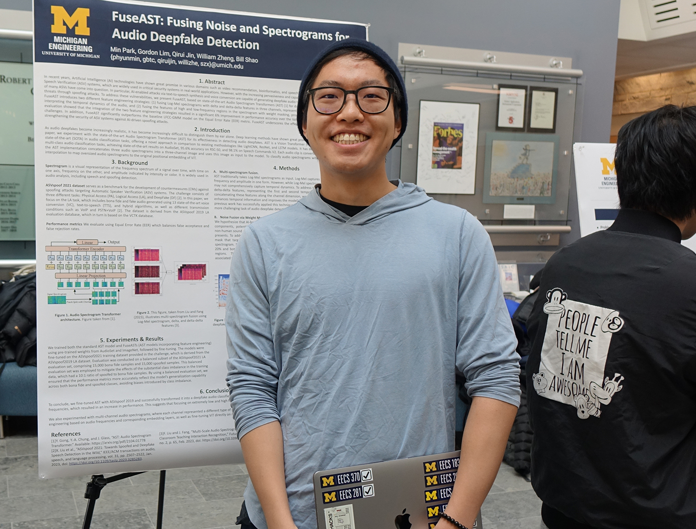
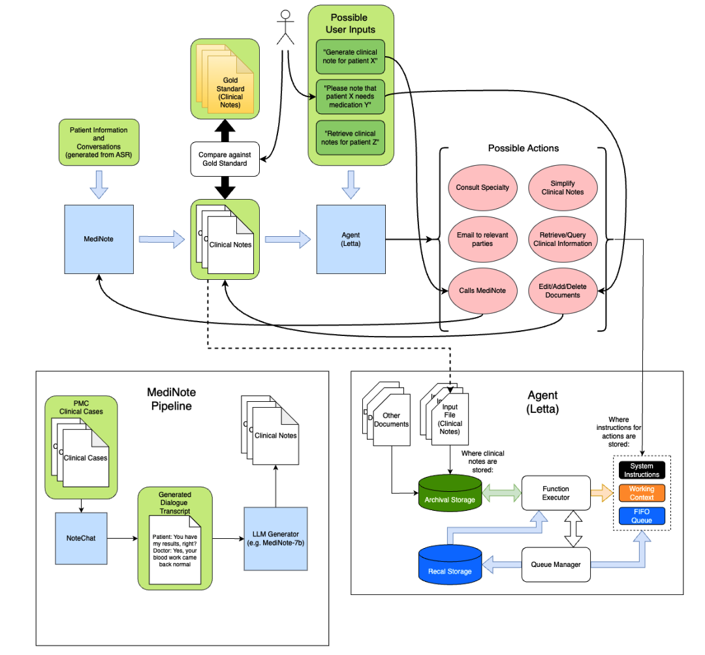

# Resume-and-Past-Projects
Just as the title says, this repository is to showcase some of the work and projects I have done! Keep in mind that some of the projects may be in progress or have not been updated in a while. Additionally, this is not an exhaustive list of what I have worked on. 
I have many course work projects as well, but I am unable to post them publicly to github for academic integrity. If you would like to view my course projects in machine learning, cyber security, algorithms, optimization, and more, feel free to reach out to me at willizhe@umich.edu.  
Public projects and the links to their respective repositories are listed  below.

## 2024-2025 Senior

### Courses Taken:
- #### Machine Learning Research Experience, EECS 498
    - In the first half of the course, we covered the various fields of machine learning research, of which I presented the findings of numerous papers. In the second half of course, I collaborated with fellow researchers to investigate ways to improve deep-fake audio detections through Audio Spectrogram Transformers. We written up our results in a paper and presented our findings in a poster presentation. 

    - Results and relevant materials can be found in the *Machine Learning Research Experience, EECS 498* folder.

- #### Advance Directed Study (LettiNote), EECS 499
    - In my senior year, I wanted to further my skills in conducting machine learning research. With guidence from my advisor, I researched how to improve clinical note generation for medical use and the possibility of having LLM agents help automate menial tasks. In this project, I developed the skills to finetune LLM models on SLURM and GPUs.
    - Results can be found in the *Advance Directed Study (LettiNote), EECS 499* folder.

- #### Practical Data Science, EECS 398
    - Learned how to do a variety of tasks relevant to data science:
        - Web Scrapping
        - Data cleaning and inference
        - Fitting models
        - Producing figures and graphs
    - Our final project as part of the class was to apply our knowledge to a dataset of our choosing. For my project, I chose to explore gold income in League of Legends on win rates. 
    - Results and relevant materials can be found at https://github.com/NovaBro/League-of-Legends-Investigation

- #### Web Systems, EECS 485
    - Learned the basics of web development. Developed a basic version of Instagram using HTML, CSS, JavaScript, SQLite, AWS, and various other python libraries. 
    - Developed a MapReduce Framework to handle simple tasks. A MapReduce Framework involves splitting a task into smaller chunks to then be distributed amongst various workers which the results are then recombined.

## 2024 Junior - 2025 Senior
### Courses Taken:

- Conduct research and other tasks in Tomers Lab
- Intro to Machine Learning, EECS 445
- Foundations of Computer Science, EECS 376
- Intro to Computer Security EECS 388

## 2023 Sophmore - 2024 Junior year

### Courses Taken:
- Data Structures and Algorithms, EECS 281
- Programming and Intro to Data Structures, EECS 280

### NEAT_StockTrading 
https://github.com/NovaBro/NEAT_StockTrading  

### NEAT_DEMO
https://github.com/NovaBro/NEAT_DEMO/tree  
In this project, I wanted to invesitgate how to "evolve" Neural Networks. In particular, I was inspired by SethBling's video on using neural networks to play <a href="https://www.youtube.com/watch?v=qv6UVOQ0F44"> Super Mario World</a>. The research on  Neural Evolution of Augmented Topologies, was very similar to what I had in mind. In this, I tested if neural network evolution can be used for some of the challenges in Gymnasium, such as cart-pole balancing. 

### Simple-Neural-Network
https://github.com/NovaBro/Simple-Neural-Network  
During my sophmore year, I saw a video done by 3Blue1Brown on how neural network works. This project was for me to gain a better understanding of the basics. I implemented backpropogation and forward propogation by hand. The NN structure was hand coded.

